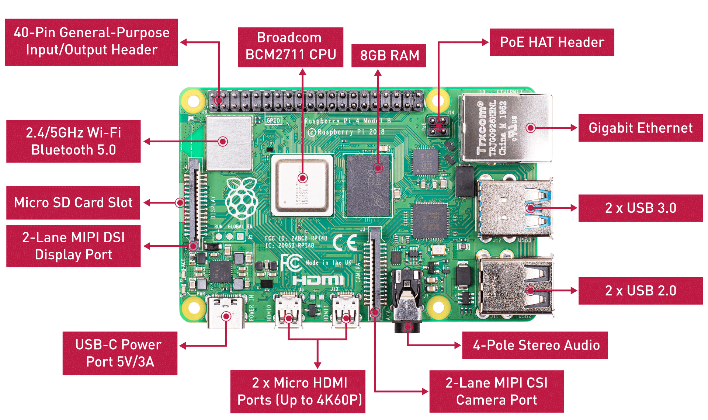

The `ThatSkyPianist` project is an innovative Music Instrument Digital Interface (MIDI) that leverages the powerful capabilities of the Raspberry Pi 4B to control GPIO pin levels to simulate screen tapping actions, automatically playing instruments in "Sky: Children of the Light". This project demonstrates how simple hardware operations can integrate programming with musical art. Theoretically, by adjusting the mapping relationship between notes and pins, `ThatSkyPianist` can not only play virtual instruments but also extend to automatically playing real pianos or other instruments, as long as the hardware conditions allow.


After importing the music score, run `fingering.py` to start playing:

```bash
python finger.py
```

## 1. The Pianist's Fingers

To simulate human playing actions, the project has designed a set of electronic devices made from the following materials:
- Dupont wires
- PC817 optocouplers
- Conductive silicone

These materials together form electronic "fingers" that can simulate human finger touches on the screen, thus achieving the purpose of automatic playing.

**First generation finger circuit design:**


>[Reference video](https://www.bilibili.com/video/BV1Fb4y1Q78Y)

**Simplified design:**


These designs show the evolution of the project from prototype to mature design, continuously optimized to improve efficiency and reliability.

## 2. The Pianist's Brain: Raspberry Pi 4B



The Raspberry Pi 4B is a highly popular card-sized computer. As the core of this project, it plays the role of "the pianist's brain". It is responsible for processing music score data, controlling GPIO pin output levels, thereby driving the electronic "fingers" to perform precise note playing. The powerful computing capability and flexible GPIO pins of the Raspberry Pi 4B make it an ideal choice to connect all parts of the project.

Here is a detailed overview and organization of the Raspberry Pi pins, including WiringPi numbers, BCM numbers, function descriptions, and physical pin numbers:

| WiringPi NO. | BCM NO. |  Function   | BOARD NO. | BOARD NO. |  Function   | BCM NO. | WiringPi NO. |
| :----------: | :-----: | :---------: | :-------: | :-------: | :---------: | :-----: | :----------: |
|      -       |    -    |    3.3V     |     1     |     2     |     5V      |    -    |      -       |
|      8       |    2    |    SDA.1    |     3     |     4     |     5V      |    -    |      -       |
|      9       |    3    |    SCL.1    |     5     |     6     |     GND     |    -    |      -       |
|      7       |  **4**  | **GPIO.7**  |   **7**   |   **8**   |     TXD     |   14    |      15      |
|      -       |    -    |     GND     |     9     |    10     |     RXD     |   15    |      16      |
|      0       | **17**  | **GPIO.0**  |  **11**   |  **12**   | **GPIO.1**  | **18**  |      1       |
|      2       | **27**  | **GPIO.2**  |  **13**   |    14     |     GND     |    -    |      -       |
|      3       | **22**  | **GPIO.3**  |  **15**   |  **16**   | **GPIO.4**  | **23**  |      4       |
|      -       |    -    |    3.3V     |    17     |  **18**   | **GPIO.5**  | **24**  |      5       |
|      12      |   10    |    MOSI     |    19     |    20     |     GND     |    -    |      -       |
|      13      |    9    |    MISO     |    21     |  **22**   | **GPIO.6**  | **25**  |      6       |
|      14      |   11    |    SCLK     |    23     |    24     |     CE0     |    8    |      10      |
|      -       |    -    |     GND     |    25     |    26     |     CE1     |    7    |      11      |
|      30      |    0    |    SDA.0    |    27     |    28     |    SCL.0    |    1    |      31      |
|      21      |  **5**  | **GPIO.21** |  **29**   |    30     |     GND     |    -    |      -       |
|      22      |  **6**  | **GPIO.22** |  **31**   |  **32**   | **GPIO.26** | **12**  |      26      |
|      23      | **13**  | **GPIO.23** |  **33**   |    34     |     GND     |    -    |      -       |
|      24      | **19**  | **GPIO.24** |  **35**   |  **36**   | **GPIO.27** | **16**  |      27      |
|      25      | **26**  | **GPIO.25** |  **37**   |  **38**   | **GPIO.28** | **20**  |      28      |
|      -       |    -    |     GND     |    39     |  **40**   | **GPIO.29** | **21**  |      29      |

The Raspberry Pi's pins have several different numbering systems:

- BOARD number: This is the physical location number of the pin, starting from 1, sorted according to the actual position on the Raspberry Pi board.
- BCM number: This is the pin number of the Broadcom chip, used to specify GPIO pins during programming.
- WiringPi number: This is the pin numbering system used by the WiringPi library, providing a simplified interface for GPIO pin programming.

### 2.1 The Pianist's Nerves: GPIO Pins

Most pins on the Raspberry Pi 4B can be configured to output high or low levels. However, it is important to note that not all 40 pins are GPIO pins. This includes dedicated power pins (3.3V and 5V), ground pins (GND), and pins with specific functions (such as I2C, SPI, UART). **Only those marked as GPIO can be configured to output high or low levels.**

When configured as output mode, GPIO pins can output two levels:
- High level: The output voltage is the same as the GPIO pin's supply voltage, which is **3.3V** for the Raspberry Pi 4B.
- Low level: The output voltage is close to 0V, which can be considered as ground level.

The Raspberry Pi 4B has **17** pins available for General Purpose Input/Output (GPIO). Listed in physical pin order, the GPIO pins of the Raspberry Pi 4B and their corresponding BCM numbers are as follows:

| Function | BCM NO. | BOARD NO. |
|:---------:|:--------:|:--------:|
| GPIO.7 | BCM 4 | 7 |
| GPIO.0 | BCM 17 | 11 |
| GPIO.1 | BCM 18 | 12 |
| GPIO.2 | BCM 27 | 13 |
| GPIO.3 | BCM 22 | 15 |
| GPIO.4 | BCM 23 | 16 |
| GPIO.5 | BCM 24 | 18 |
| GPIO.6 | BCM 25 | 22 |
| GPIO.21 | BCM 5 | 29 |
| GPIO.22 | BCM 6 | 31 |
| GPIO.26 | BCM 12 | 32 |
| GPIO.23 | BCM 13 | 33 |
| GPIO.24 | BCM 19 | 35 |
| GPIO.27 | BCM 16 | 36 |
| GPIO.25 | BCM 26 | 37 |
| GPIO.28 | BCM 20 | 38 |
| GPIO.29 | BCM 21 | 40 |

Since many instruments in SKY (such as pianos, guitars, harps, etc.) support playing a range of **15** notes (a triad), the **first 15** GPIO pins are selected in the order of physical pin numbers to control the playing of each note. The pin-note mapping relationship is as follows:

| Note | Numerical | BCM NO. | Function | BOARD NO. |
| :--: | :-------: | :-----: | :------: | :-------: |
| ,Do  |    1.     |    4    |  GPIO.7  |     7     |
| ,Re  |    2.     |   17    |  GPIO.0  |    11     |
| ,Mi  |    3.     |   18    |  GPIO.1  |    12     |
| ,Fa  |    4.     |   27    |  GPIO.2  |    13     |
| ,Sol |    5.     |   22    |  GPIO.3  |    15     |
| ,La  |    6.     |   23    |  GPIO.4  |    16     |
| ,Si  |    7.     |   24    |  GPIO.5  |    18     |
|  Do  |     1     |   25    |  GPIO.6  |    22     |
|  Re  |     2     |    5    | GPIO.21  |    29     |
|  Mi  |     3     |    6    | GPIO.22  |    31     |
|  Fa  |     4     |   12    | GPIO.26  |    32     |
| Sol  |     5     |   13    | GPIO.23  |    33     |
|  La  |     6     |   19    | GPIO.24  |    35     |
|  Si  |     7     |   16    | GPIO.27  |    36     |
| Do'  |    1'     |   26    | GPIO.25  |    37     |

## 3. The Pianist's Music Score

### 3.1 Digital Representation of the Music Score

This project uses CSV files to store music scores, facilitating easy program reading. CSV (Comma-Separated Values) files are a simple text file format used for storing tabular data.

First, it's necessary to design & agree upon the structure of the music score:

- **Note**: Each note is separated by a `,`. If there is a pause between notes, then two `,` are used to indicate the pause.

- **Measure**: Each non-empty line in the CSV file represents a measure, and each measure can contain a different number of notes.
- **Phrase**: A phrase consists of multiple measures, separated by a line containing multiple `,`, with the number of `,` indicating the number of beats in the pause between phrases.

Additionally, the project supports tempo variation:

- **Accelerando** (`accel.`): Indicated by the abbreviation `accel.`, followed by a number indicating how much the BPM (beats per minute) will increase from the original tempo within that measure.
- **Ritardando** (`rit.`): Indicated by the abbreviation `rit.`, followed by a number indicating how much the BPM will decrease from the original tempo within that measure.

Tempo variation adds expressiveness and dynamic changes to the music, making it more lively and engaging.

For example, the first two phrases of "Flower Sea":

```bash
1, 3, 3, , 3, 2, 1, 2, 3
1, 3, 3, , 4, 3, 5, 1
1, 4, 4, , 4, 3, 1, 5., 3
rit.-20, 1, 3, 2, 1, 3, 2, 1, 3, 2
,
1, 3, 3, , 3, 2, 1, 2, 5
accel.-20, 1, 3, 3, , 4, 3, 5, 1
1, 4, 4, , 4, 3, 1, 5, 3, 1'
5, 4, 4, 1, 1, 7., 1
```

> Note: To indicate a pause at the end of a measure, add a `,` after the last note.

### 3.2 Playing Speed (Style)

The project supports playing music at various tempos, accommodating different musical styles and preferences. Playing speed (also known as tempo marking) primarily indicates the speed or rhythm of a piece of music, with the following being some common tempo markings and their approximate BPM (beats per minute) ranges.

| Classical Music Style | BPM Range | Popular Music Style | BPM Range |
|----------------------:|:----------|--------------------:|:----------|
| Largo                 | [40, 60]  | Hip-Hop             | [60, 100] |
| Adagio                | [66, 76]  | Pop                 | [100, 130]|
| Andante               | [76, 108] | Rock                | [110, 140]|
| Moderato              | [108, 120]| EDM                 | [120, 130]|
| Allegro               | [120, 168]| Dance               | [120, 130]|
| Presto                | [168, 200]| Dubstep             | [140, 141]|
| Prestissimo           | [200, 220]| Drum & Bass         | [160, 180]|
|                       |           | Bass                | [160, 180]|

The project offers a total of 15 different playing speeds, including 7 classical music styles and 8 popular music styles. Each performance will randomly select a BPM within the specified style's BPM range, ensuring each performance is unique.

### 3.3 Playing Modes

- **Monophonic Playing**: At any given moment, only one note is played, representing the simplest form of musical texture, consisting of a single melodic line without harmonic accompaniment.
- **Chord Playing**: Multiple notes are played simultaneously to produce harmonious or dissonant sounds, a fundamental way of creating harmony in music. Chords are made up of three or more notes of different pitches, which, when sounded together, create the sound of a chord. This project uses concurrency to achieve chord playing.

Digital representation of chords in the music score: Chords are represented by connecting the notes within the chord with `-`, for example, `1.-2.-3.` indicates that the chord is composed of notes `1`, `2`, and `3`. Chords and individual notes are still separated by `,`, for example:

```bash
5, 4, 4, 1, 1-2-3, 7., 1
```

## Future Pianists (TODO List)

- **Music Analysis Tools**: Develop more advanced music analysis tools based on Fourier transforms to automatically recognize music and convert it into playable digital scores.
- **Improvisation and Composition**: Explore generative AI for improvisation and composition, allowing `ThatSkyPianist` to not only reproduce existing pieces but also create new ones.

## Quick Start

To start using `ThatSkyPianist` for music creation and performance, please follow these steps:

1. **Prepare the Hardware**: Ensure you have a Raspberry Pi 4B and the necessary electronic components (Dupont wires, PC817 optocouplers, conductive silicone, etc.).

2. **Set Up the Raspberry Pi**: Follow the official Raspberry Pi documentation to set up your device, installing the latest operating system and necessary software packages.

3. **Download the Project Code**: Clone or download the `ThatSkyPianist` project code to your Raspberry Pi from the GitHub repository.

4. **Assemble the Electronic "Fingers"**: Refer to the project documentation for guidance on assembling your electronic "fingers".

5. **Configure the GPIO Pins**: Based on your instrument and music score, configure the GPIO pins to map to the notes.

6. **Import the Music Score**: Import your music score in CSV format into the specified directory of the project.

7. **Run the Performance Script**: Execute the `fingering.py` script to start the performance.


## Contribution

The `ThatSkyPianist` project welcomes anyone interested in music and programming to contribute their strength. Whether it's adding new scores, improving hardware design, or developing new features, your contributions will make this project more complete. Please visit our GitHub repository to view current issues or submit new pull requests.

## License

The `ThatSkyPianist` project is released under the MIT license. This means you are free to use, modify, and distribute this project, but you must include a copy of the original license.

## Contact Us

If you have any questions, suggestions, or want to share your creations, please do not hesitate to contact us through the following means:

- **Email**: [zhimin.aisecty@gmail.com](mailto:zhimin.aisecty@gmail.com)
- **GitHub**: [https://github.com/gongzhimin/ThatSkyPianist](https://github.com/gongzhimin/ThatSkyPianist)

We look forward to hearing from you and taking the `ThatSkyPianist` project to new heights together!